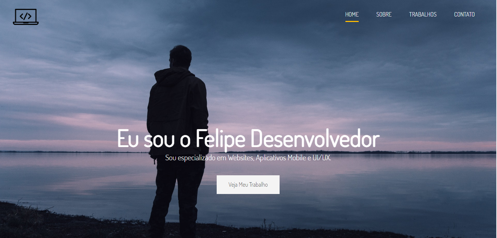

<h1 align="center">
  Portfolio Website With Sass
</h1>

## 📋 Índice

- [Preview](#-Preview)
- [Sobre](#-Sobre)
- [Tecnologias utilizadas](#-Tecnologias-utilizadas)
- [Como executar o projeto](#-Como-executar-o-projeto)

---

## 🖥 Preview

  

---

## 📖 Sobre 

Página web de portfólio pessoal utilizando a tecnologia SASS para construção do CSS, site desenvolvido como projeto final do curso 'Modern HTML & CSS From The Beginnig' do professor Brad Traversy. Voce pode acessar o site completo pelo link https://serene-euclid-d797b4.netlify.app/

---

## 🚀 Tecnologias utilizadas
O projeto está sendo desenvolvido com as seguintes tecnologias:
- HTML5
- CSS3
- SASS

---

## ⌨ Como executar o projeto

Após instalação do node.js em sua máquina rode os seguintes comandos no terminal
- npm init
- npm install node-sass -D
- npm run sass

---
